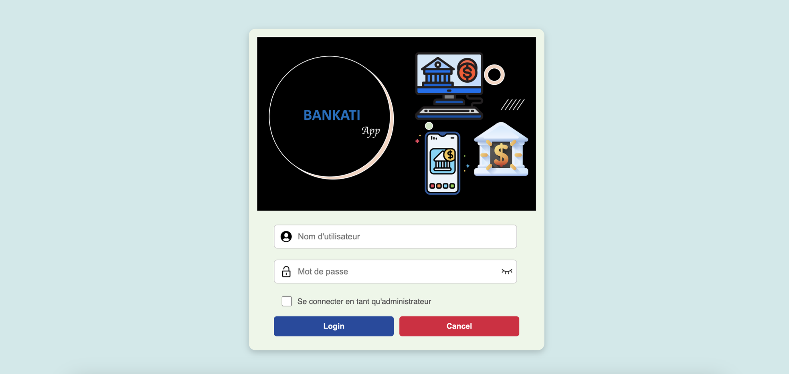
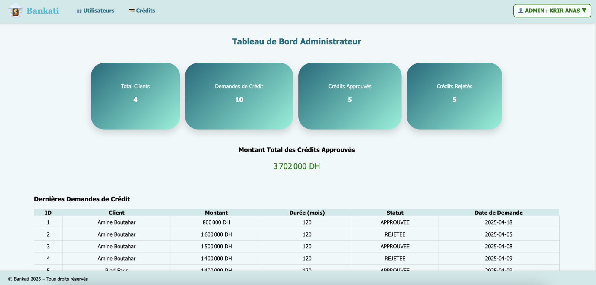
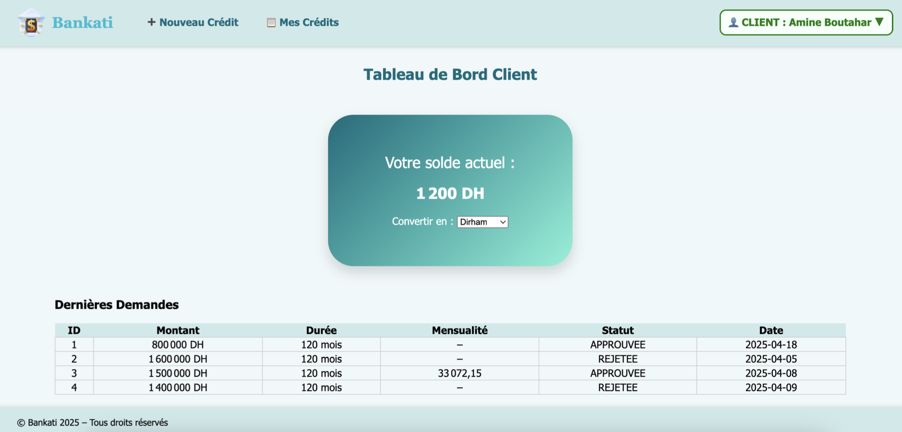
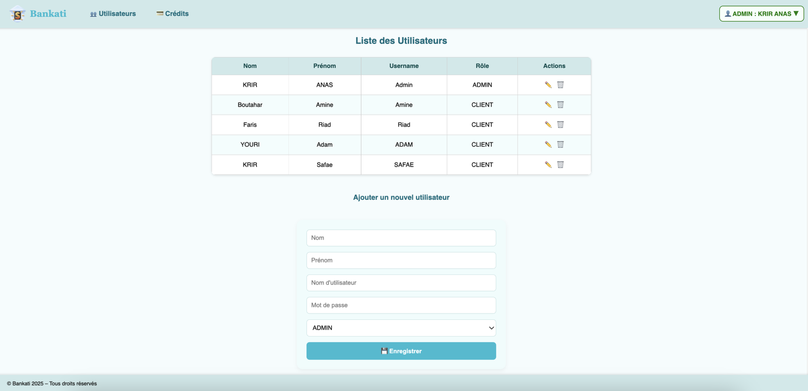
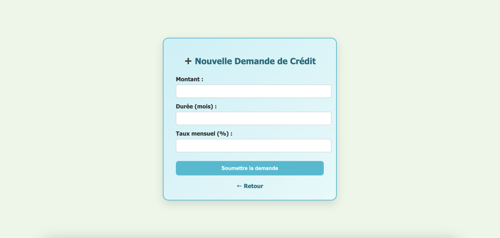
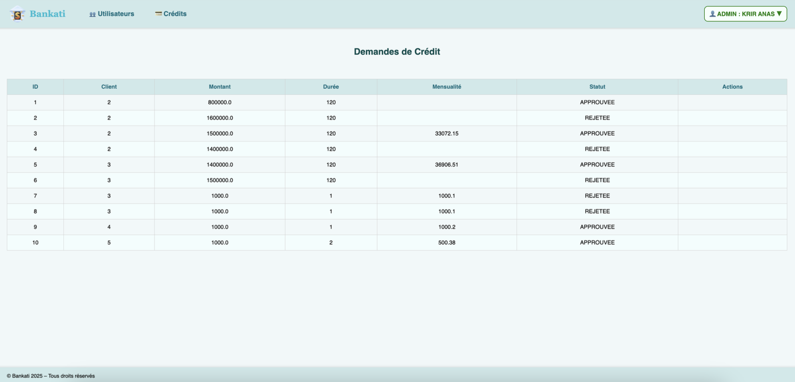
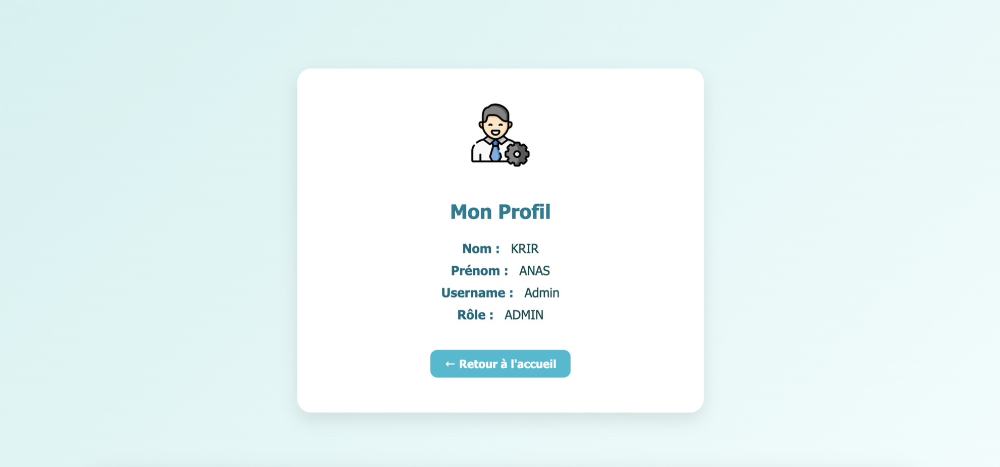
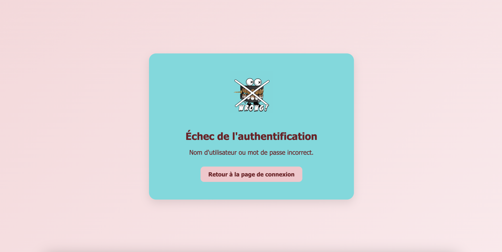

# 🏦 Bankati Web App — Application bancaire (Spring Boot)


Application web bancaire développée en **Spring Boot** permettant la gestion des **utilisateurs, comptes bancaires et crédits** avec rôles **Admin / Client**.  
Ce projet est le résultat de **plusieurs évolutions techniques** : stockage fichier → JDBC MySQL → Spring Boot + JPA.

---

## 📌 Sommaire

1. [Historique du projet](#-historique-du-projet)
2. [Fonctionnalités](#-fonctionnalités)
3. [Stack technique](#-stack-technique)
4. [Architecture du projet](#-architecture-du-projet)
5. [Démarrage rapide](#-démarrage-rapide)
6. [Comptes de connexion](#-comptes-de-connexion)
7. [Aperçu UI](#-aperçu-ui)
8. [Auteurs](#-auteurs)
9. [Licence](#-licence)

---

## 🕓 Historique du projet

| Phase | Description | Technologie |
|-------|-------------|-------------|
| 📍 Phase 1 | Version initiale avec stockage **fichier texte (.txt)** | Servlets, JSP, DAO |
| 📍 Phase 2 | Migration vers **MySQL + JDBC** | DAO + JDBC |
| 📍 Phase 3 | Migration finale vers **Spring Boot + JPA + Thymeleaf** | Spring Boot, MySQL, JPA |

---

## ✅ Fonctionnalités

👤 Authentification (Admin / Client)  
🏦 Gestion des comptes bancaires (solde, devise)  
💳 Gestion des crédits (demande, validation, suppression)  
🧾 Historique des crédits  
🛠️ CRUD administrateur sur les utilisateurs  
🔐 Sécurité avec Spring Security  
🗄️ Persistance MySQL via Spring Data JPA  
🎨 Interface responsive (Thymeleaf + CSS custom)  

---

## 🛠️ Stack technique

| Technologie | Version |
|-------------|---------|
| Java | 17 |
| Framework | Spring Boot 3.5.5 |
| ORM | JPA / Hibernate |
| Base de données | MySQL 8.0 |
| Build Tool | Maven |
| View Engine | Thymeleaf |
| Lombok | ✅ (réduction du boilerplate) |
| IDE conseillé | IntelliJ IDEA CE |

---

## 🏗️ Architecture du projet

```
ma.bankati
├─ controllers/ → Couches Web (routes, endpoints)
├─ services/ → Logique métier
├─ repositories/ → DAO Spring Data JPA
├─ entities/ → Modèles (Client, Compte, Crédit...)
├─ resources/
│ ├─ templates/ → Pages Thymeleaf
│ └─ static/assets/ → CSS, JS, images, audio
└─ BankatiApplication.java → Main App
```


---

## 🚀 Démarrage rapide

### 1️⃣ Prérequis

✅ Java **17+**  
✅ MySQL installé + base `bankati` créée  
✅ IntelliJ IDEA / VS Code / Eclipse  
✅ Maven ou wrapper `mvnw`  
✅ Plugin Lombok activé dans l’IDE  


### 2️⃣ Configuration MySQL (exemple `application.properties`)

```properties
spring.datasource.url=jdbc:mysql://localhost:3306/bankati
spring.datasource.username=xxxx
spring.datasource.password=xxxx
spring.jpa.hibernate.ddl-auto=update
spring.jpa.show-sql=true
```

### 3️⃣ Lancer l’application


```
# via Maven
mvn spring-boot:run
```

ou dans IntelliJ :


```
Right click → Run 'BankatiApplication'
```
---


## 🔑 Comptes de connexion


| Rôle   | Username | Password |
| ------ | -------- | -------- |
| Admin  | Admin    | 1234     |
| Client | ADAM     | 1234     |

---

## 🖼️ Aperçu (Screenshots)

| Login | Dashboard Admin | Dashboard Client | Liste des utilisateurs | Demande de crédit |
|-------|-----------------|------------------|------------------------|-------------------|
|  |  |  |  |  |

| Liste des crédits | Profil | Page d’erreur |
|-------------------|--------|---------------|
|  |  |  |

---

## 👥 Auteurs

- **Anas KRIR** — Développeur Back-End / Gestion du projet
- **Adam EL YOURI** — Développeur Front-End / UI & intégration

---

 ## 📄 Licence

Projet sous licence MIT. <br/>
✅ Libre d’utiliser, modifier, distribuer.

© 2025 — KRIR Anas & EL YOURI Adam

---


